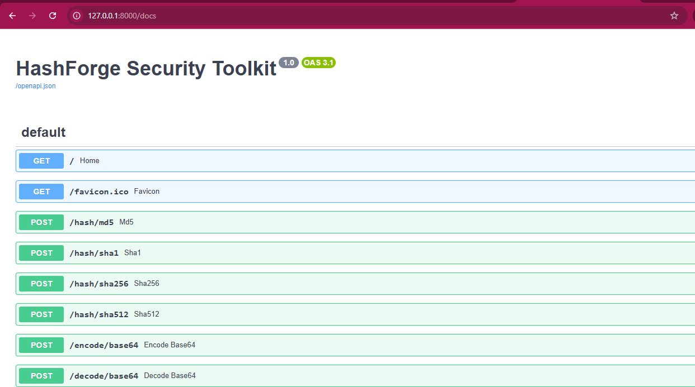
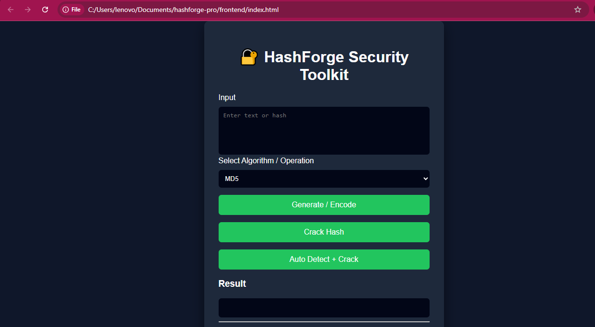

# 🔐 HashForge Security Toolkit

HashForge is a cybersecurity toolkit built using **FastAPI (Python)** and **JavaScript**.  
It provides tools for hashing, encoding/decoding, password cracking using wordlists, and file hashing.

---

## 🚀 Features

### 🔑 Hash Generation
Supports secure hashing algorithms:

- MD5
- SHA1
- SHA256
- SHA512

---

### 🔄 Encoding / Decoding

- Base64 Encode
- Base64 Decode
- Hex Encode
- Hex Decode

---

### 🔍 Hash Cracking

HashForge can crack hashes using a dictionary attack with **rockyou.txt**.

Example:

Input Hash:
5d41402abc4b2a76b9719d911017c592

Output:
Algorithm: MD5
Password: hello

---

### 🧠 Auto Hash Detection

Automatically detects hash algorithm and attempts cracking.

Supported detection:

- MD5
- SHA1
- SHA256
- SHA512

---

### 📂 File Hashing

Upload a file and generate:

- MD5
- SHA1
- SHA256
- SHA512

---

## 🛠️ Tech Stack

Backend:

- Python
- FastAPI
- hashlib

Frontend:

- HTML
- CSS
- JavaScript

Tools:

- Git
- GitHub

---

## 📁 Project Structure

hashforge-pro
│
├── backend
│ ├── main.py
│ ├── hashing.py
│ ├── cracker.py
│ ├── auto_crack.py
│ ├── hash_detector.py
│ ├── hmac_utils.py
│
├── frontend
│ ├── index.html
│ ├── app.js
│ ├── styles.css
│
├── requirements.txt
└── README.md

---

## ⚙️ Installation

Clone the repository:

git clone https://github.com/sachinsuresh2006s-ship-it/hashforge-security-toolkit.git

Go to the project folder:

cd hashforge-security-toolkit/backend

Install dependencies:

pip install -r requirements.txt

---

## ▶️ Run Backend

Start FastAPI server:

uvicorn main:app --reload

Server will run at:

http://127.0.0.1:8000

API documentation:

http://127.0.0.1:8000/docs

---

## 🌐 Run Frontend

Open the file:

frontend/index.html

in your browser.

---

## 📥 Download Wordlist

Download **rockyou.txt** from:

https://github.com/brannondorsey/naive-hashcat/releases/download/data/rockyou.txt

Place it inside:

backend/

---

Example UI:

- Hash generation
- Auto detect + crack
- File hashing

---

- Multi-threaded hash cracking
- Progress bar for cracking
- Hacker terminal UI animation
- Support for bcrypt and other hashes
- Deploy online

---

## 👨‍💻 Author

Sachin Suresh

GitHub:
https://github.com/sachinsuresh2006s-ship-it

---

## ⭐ Contribute

Pull requests and suggestions are welcome.